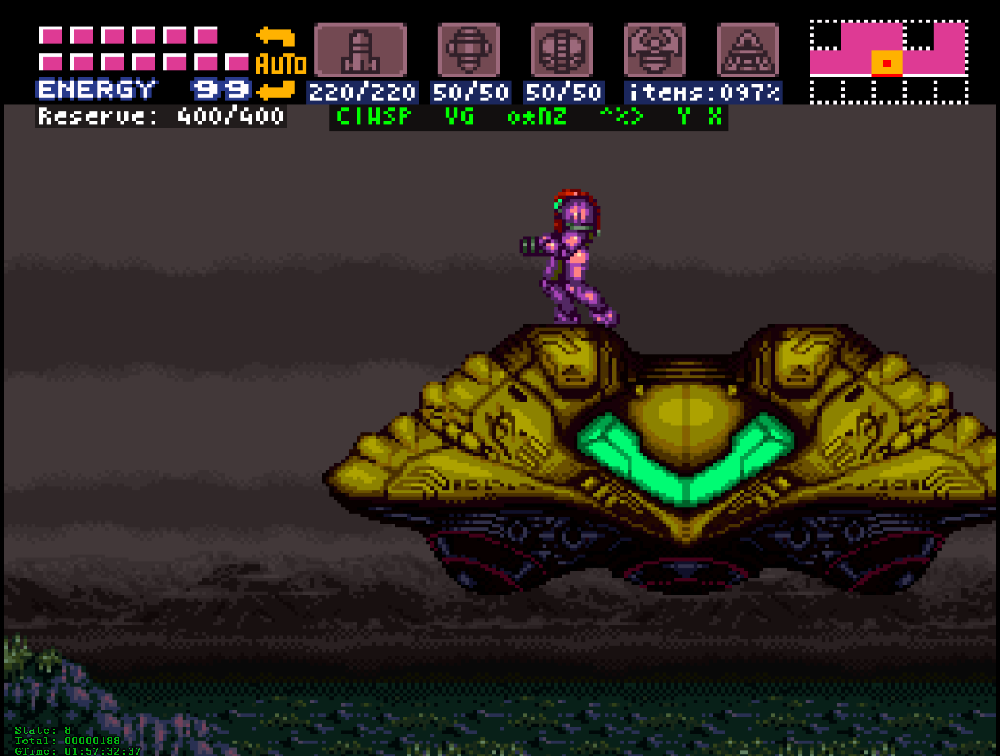

# Super Metroid Tools

A repository of Lua Code for the Bizhawk Emulator and Super Metroid.

# How to Install

## What you will need

- The Bizhawk Emulator ([BizHawk Download](http://tasvideos.org/BizHawk.html))
- The US/Japan Super Metroid Rom
- This script

## Installation

1. Install Bizhawk
2. Copy the script into BizHawkDir/Lua/SNES/SuperMetroid.lua (Note, it comes with Super Metroid.lua)
3. copy the ROM someplace that Bizhawk can find it
4. Open Bizhawk
5. Open the ROM file
6. Click *Tools* > *Lua Console*
7. In the Lua Console, *Script* > *Open Script*
8. Select the SuperMetroid.lua script
9. Start playing the game. You should see statistics on the screen.

# Explanation of the Lua Script

## Lines 3-11

These lines were written by Pasky13, the person who wrote the default script that's included with Bizhawk. It sets up two global variables that track the current scaling factor. This is usually integer (1-4) however it could be decimal in the case of fullscreen views.

## Lines 12-16

These are global variables that determine the text color and background color for the text as well as the position for the status panel.

## Lines 18-29

These lines define the data in the class that is used to create the panel at the bottom left of the screen. The variables inside will be passed to the appropriate functions for drawing the panel.

## Lines 31-38

Constructor for the BottomPanel class.

## Lines 40-42

This inserts a line of text onto the panel for rendering in the game window

## Lines 44-84

This function calculates the size and position of the bottom rectangle. Below in the subsections I describe each section of the function

### > Lines 45-50

Define all the variables needed for the function. boxHeight is how big the box should be vertically, while the gameWidth determines how wide the viewport is. biggestWidth determines the maximum width of the longest string in characters so that the box rendered is big enough for it. width is the width of the box in pixels as determined by biggestWidth.

### > Lines 54-55

This calculates the game viewport size based on the viewport's height.

### > Lines 58-61

The box sizing is inclusive of the border, so it has to account for the border size if a border is specified.

### > Lines 63-64

Does the actual calculation for the height

### > Lines 66-69

Figures out the longest string and stores the number of characters in that string in biggestWidth

### > Line 71

Determines the actual width by multiplying the biggest width by the character width. It also addes the current width which may be more than 0 if there's a border.

### > Line 73

Stores the width in the object

### > Lines 75-77

Determines the offset needed to put the box on the bottom left hand corner of the game viewport as opposed to the window.

### > Lines 81-83

Assigns the offsets to the object and returns the pair of offsets.

## Lines 86-102

Renders the actual panel into the game viewport. Individual lines are described below:

## Lines 104-144

showStats function. The function reads time, frame counter, and state from the game's memory. It then has a filter that zeros out the values if the game is currently not being played (such as in the pre-game menus or during opening and closing cut-scenes). Next the strings to display are formatted and then the Renderer panel class is used to render the text towards the bottom. Below that are some commented out lines indicating how I had originally displayed the text.

## Lines 148-185

This is a table that contains the values to be displayed on the screen for the HUD and default initializations.

First is the maximum energy capacity for Samus. This can range from 99 to 1499.

Then pairs of the current amount and capacity of various consumable items: Missiles, Super Missiles, Power Bombs, and finally Reserve Tanks.

The itemsCollected field contains the current percentage of Items obtained. There are 100 unique pickups and so no division is necessary to obtain the percentage.

Next are three bytes that are obtained from the game's memory which are stored in a raw format.

Finally there are booleans for each of the unique, non-quantized items that can either be collected or not collected. There are five beams, two suits, four miscelaneous abilities (mainly to do with jumping and morphing), three boots, and two modal items that can be selected in the top menu after the consumable items.

## Lines 187-197

The updateQuantities function fills the above table with the consumable item quantities. It reads the information directly from memory and stores them since all of them are integers.

## Lines 199-255

The updateItems function reads the three bytes from memory that indicate which non-consumable pickups have been obtained. These are all of the items in the "Samus" screen in the pause menu as well as the last two modal icons at the top of the screen during normal play. Strangely, the charge beam has its own byte. Not sure why, but that's the way that the game stores the values. Maybe to make the branching easier in the code that determines whether holding the fire button shoots successive beams at a predetermined rate or whether the charge functionality should be invoked. Either way, it is accounted for by reading it directly from the struct. The others are copied so as to make working with them less repetitive.

Next is a series of comments that visualize the memory layout of these bytes along with a sample value I obtained mid-game using Bizhawk's tools. It's interesting to note that the items are not stored in the same order as seen in the menu or my UI. Below is a table describing the values:

<table style="undefined;table-layout: fixed; width: 100%;text-align: center;">
<colgroup>
<col style="width: 70px"> <col style="width: 70px"> <col style="width: 70px"> <col style="width: 70px"> <col style="width: 70px"> <col style="width: 7px"> <col style="width: 70px"> <col style="width: 70px"> <col style="width: 70px"> <col style="width: 70px"> <col style="width: 7px"> <col style="width: 70px"> <col style="width: 70px"> <col style="width: 70px"> <col style="width: 70px"> <col style="width: 7px"> <col style="width: 70px"> <col style="width: 70px"> <col style="width: 70px"> <col style="width: 70px">
</colgroup>
<thead>
  <tr>
    <th colspan="20"><h1>Little-Endian Unsigned 16-bit Word 0x09A4</h1></th>
  </tr>
</thead>
<tbody>
  <tr>
    <td>Item</td> <td>X-Ray Scope </td> <td>Grapple Beam</td> <td>Speed Booster</td> <td>Bombs</td> <td rowspan="3"></td> <td>Unused</td> <td>Unused</td> <td>Space Jump Boots</td> <td>High Jump Boots</td> <td rowspan="7"></td> <td>Unused</td> <td>Unused</td> <td>Gravity Suit</td> <td>Unused</td> <td rowspan="3"></td> <td>Screw Attack</td> <td>Morph Ball</td> <td>Spring Ball</td> <td>Varia Suit</td>
  </tr>
  <tr>
    <td>Code</td> <td>X</td> <td>Y</td> <td>&gt;</td> <td>*</td> <td></td> <td></td> <td>%</td> <td>^</td> <td></td> <td></td> <td>G</td> <td></td> <td>Z</td> <td>o</td> <td>N</td> <td>V</td>
  </tr>
  <tr>
    <td>Mask</td> <td>0x8000</td> <td>0x4000</td> <td>0x2000</td> <td>0x1000</td> <td>0x0800</td> <td>0x0400</td> <td>0x0200</td> <td>0x0100</td> <td>0x0080</td> <td>0x0040</td> <td>0x0020</td> <td>0x0010</td> <td>0x0008</td> <td>0x0004</td> <td>0x0002</td> <td>0x0001</td>
  </tr>
  <tr>
    <td colspan="10"><h1>8-bit Byte 0x09A9</h1></td>
    <td colspan="9"><h1>8-Bit Byte 0x09A8</h1></td>
  </tr>
  <tr>
    <td>Item</td> <td>Unused</td> <td>Unused</td> <td>Unused</td> <td>Charge Beam</td> <td rowspan="3"></td> <td>Unused</td> <td>Unused</td> <td>Unused</td> <td>Unused</td> <td>Unused</td> <td>Unused</td> <td>Unused</td> <td>Unused</td> <td rowspan="3"></td> <td>Plasma Beam</td> <td>Spazer Beam</td> <td>Ice Beam</td> <td>Wave Beam</td>
  </tr>
  <tr>
    <td>Code</td> <td></td> <td></td> <td></td> <td>C</td> <td></td> <td></td> <td></td> <td></td> <td></td> <td></td> <td></td> <td></td> <td>P</td> <td>S</td> <td>I</td> <td>W</td>
  </tr>
  <tr>
    <td>Mask</td> <td>0x80</td> <td>0x40</td> <td>0x20</td> <td>0x10</td> <td>0x08</td> <td>0x04</td> <td>0x02</td> <td>0x01</td> <td>0x80</td> <td>0x40</td> <td>0x20</td> <td>0x10</td> <td>0x08</td> <td>0x04</td> <td>0x02</td> <td>0x01</td>
  </tr>
  <tr>
    <td colspan="20">Mask Value: <code>bool hasItem = (mainmemory.readbyte(0x09A8) &amp;&amp; maskColumnValue &gt; 0);</code></td>
  </tr>
</tbody>
</table>

From here, I use Bizhawk's built in bit-checker API to assign the correct boolean value from the binary fields to the appropriate fields on the table. The bit-checker API obviated the need to use bitwise operators that are not available in Lua.

## Lines 257-271

This is the function that does the magic. It first has some local values to tweak the appearance of the HUD. Colors, Locations, and Sizes are all defined here as well as reading a byte code for the game's state. It would probably be prudent in the future to adjust the gameState code to identify the state with text as well as to reduce the number of calls to readbyte which may have profiling implications.

Next the update function is called to get the values for the current frame into the global items table.

The next section formats the strings for each of the icons at the top of the screen as well as the reserve tank quantity under the energy tanks.

## Lines 273-288

The if statement on line 273 checks that the game is in the playing state. There are several values associated with that playing state and so specific values of non-playing state are checked instead. We also are excluding the new game menu screens.

Finally we draw a rectangle that covers the original numeric pixels below the three icons and draw each of the quantity strings over top of them. There's also a check that the maximum quantity is greater than zero before drawing them. Otherwise it would show "000/000" where there is no icon.

There are some trim offsets added to the text to put the text 2px below the covering rectangle. And to manually adjust the horizontal position of the text to place them nicely under each icon.

## Lines 290-331

First we create a table for the two collected and non-collected strings. This is so that we can render the uncollected string which has darker a gray color first, and then render over top of it the collected string in green. This makes it so they behave like toggles where the uncollected state is gray, and the collected state turns that same icon green.

Next is a function that calculates the collection rate by adding up which items we've collected (the main series of items) and adding that to all of the consumable's maximums. We start by updating the item collection and the quantities of consumables. Next we read the game state again so we can respond if the game state changes. Next we do some division. Missile, Super Missile, and Powerbomb pickups always increase the maximum by five. So we should only have multiples of five and can divide the maximum by five to get the number of pickups for those consumables that we've collected. Next we divide the quantity of energy save for the 99 we get by default by 100 to obtain the number of energy tanks. Reserve tanks are multiples of 100 with no additional quantity so we just need to divide by 100.

Next we initialize an accumulator for pickups and add each true value for the singular items to the accumulator, and then finally add the accumulator, ammo pickups, energy tank pickups, and reserve tank pickups and store it in the itemsCollected field.

## Lines 333-348

We show the items collection rate in this function. The first three lines of code updates the item count and limit the output to certain game modes. Next is a series of comments of code I had originally written which was too complex. I kept it in comments because I used it as a template for how to handle the drawing more simply.

Instead we calculate the collection rate using the previous function, then we store a collection string by formatting Items:000. Then we project the text onto the screen.

## Lines 350-375

This is the beginning of the show items function. We start with the usual suspects: update items, check the game state, and then get to the meat of the code.

From lines 356-358, we declare the default positions and a string template to use for the HUD.

Then from lines 359-375 we create an empty table and treating it like a hash map, we assign the values of each item to various keys from the string template. This makes it so that the appropriate character is displayed in the correct color.

## Lines 377-383

Next we declare local variables for position, character width, colors, and a defaulted bar-width. The bar-width is calculated using the template and character widths later in the code.

## Line 385

In this line, we create the background rectangle over the part of the screen where the hud will be displayed.

## Lines 387-403

Now that everything is in place, we can loop over the format string, use substring to get the nth character in the format string. Next we do the actual logic: If the key doesn't match the space character, then we should process the booleans and respond accordingly.

Processing the booleans, means that we will check if the value for that key in the table is true or false. If it's true, then we will display the letter in green, otherwise, in gray.

finally, regardless what character we got, we will advance the position by the character width. Thankfully the font used by default is fixed width.

## Lines 407-414

These final lines set up an infinite loop. At this point, the script has only defined functions and globals. So now it's time to invoke them. The first function is original to the script written by pasky13. The remaining four were defined above and respectively shows the bottom panel, puts the current/max values over the icons, then draws the collection rate below the icons, and finally draws the HUD for upgrade collection.

The final line of the loop tells the game it may render the next frame.
